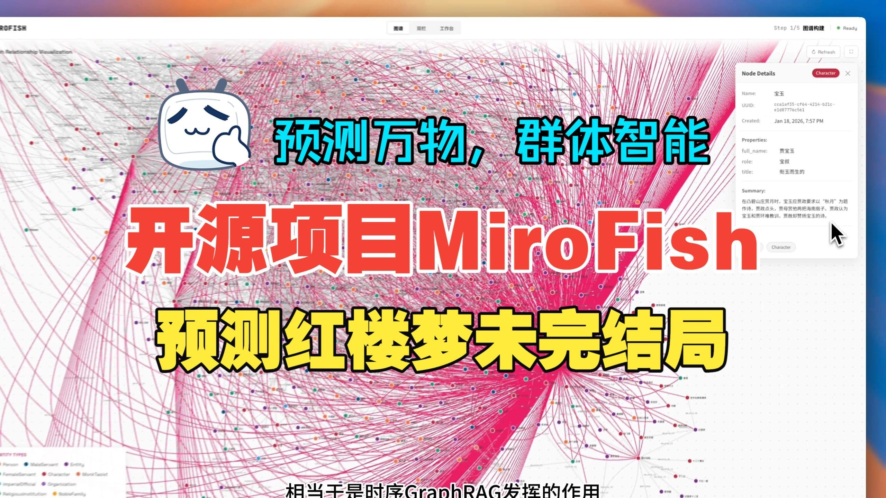
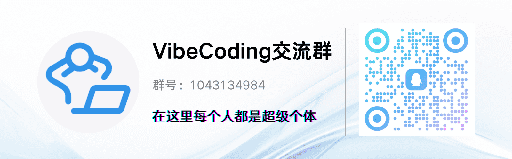

<div align="center">


<a href="https://trendshift.io/repositories/16144" target="_blank"></a>

<em>A Simple and Universal Swarm Intelligence Engine, Predicting Anything</em>

<a href="https://www.shanda.com/" target="_blank"></a>
[](https://hub.docker.com/)
[](https://deepwiki.com/666ghj/Analytics Fish)

[](http://discord.gg/ePf5aPaHnA)
[](https://x.com/analyticsfish_ai)
[](https://www.instagram.com/analyticsfish_ai/)

</div>

## ⚡ Overview

**Analytics Fish** is an AI-powered prediction engine that uses multi-agent simulations to forecast outcomes and generate predictions based on your data.

### How It Works

1. **Upload Your Data**: Provide a dataset (PDF, Markdown, or text files) as seed information for the simulation
2. **Define Your Goal**: Describe what you want to predict in natural language
3. **Create AI Agents**: The system automatically generates multiple AI agents with distinct personalities and memories
4. **Agent Interaction**: These agents interact with each other in a simulated environment, exploring scenarios and possibilities
5. **Final Interview**: An interview agent questions all the participating agents to gather insights and generate predictions
6. **Get Results**: Receive a comprehensive prediction report with detailed analysis

### Key Features

- **Simple to Use**: Just upload documents and describe your prediction goal
- **Multi-Agent Simulation**: Leverage swarm intelligence to explore complex scenarios
- **Interactive Reports**: Chat with agents and explore the simulation results
- **Flexible Applications**: Works for business predictions, creative writing, trend analysis, and more

### Use Cases

- Financial market predictions
- Policy impact analysis  
- News trend forecasting
- Story and creative writing generation
- Opinion polling and sentiment analysis
- Business decision forecasting

## 📸 Interface

<div align="center">


*Analytics Fish user interface: Upload your data, describe your prediction goal, and let AI agents analyze and forecast outcomes*
</div>

## 🎬 Demo Videos

### 1. Wuhan University Public Opinion Simulation + Analytics Fish Project Introduction

<div align="center">
<a href="https://www.bilibili.com/video/BV1VYBsBHEMY/" target="_blank"></a>

Click the image to watch the complete demo video for prediction using BettaFish-generated "Wuhan University Public Opinion Report"
</div>

### 2. Dream of the Red Chamber Lost Ending Simulation

<div align="center">
<a href="https://www.bilibili.com/video/BV1cPk3BBExq" target="_blank"></a>

Click the image to watch Analytics Fish's deep prediction of the lost ending based on hundreds of thousands of words from the first 80 chapters of "Dream of the Red Chamber"
</div>

> **Financial Prediction**, **Political News Prediction** and more examples coming soon...

## 🔄 Workflow

The Analytics Fish system follows a five-stage pipeline:

| Stage | Description |
|-------|-------------|
| **1. Graph Building** | Extract information from your uploaded data and create a knowledge graph representation |
| **2. Agent Generation** | Automatically generate AI agents with unique personalities and roles based on the data |
| **3. Simulation** | Run interactive simulation where agents engage with each other and explore different scenarios |
| **4. Report Generation** | Interview agents and compile findings into a comprehensive prediction report |
| **5. Interaction** | Chat with individual agents and the report agent to explore results in detail |

## 🚀 Quick Start

### Option 1: Source Code Deployment (Recommended)

#### Prerequisites

| Tool | Version | Description | Check Installation |
|------|---------|-------------|-------------------|
| **Node.js** | 18+ | Frontend runtime, includes npm | `node -v` |
| **Python** | ≥3.11, ≤3.12 | Backend runtime | `python --version` |
| **uv** | Latest | Python package manager | `uv --version` |

#### 1. Configure Environment Variables

```bash
# Copy the example configuration file
cp .env.example .env

# Edit the .env file and fill in the required API keys
```

**Required Environment Variables:**

```env
# LLM API Configuration (supports any LLM API with OpenAI SDK format)
# Recommended: Alibaba Qwen-plus model via Bailian Platform: https://bailian.console.aliyun.com/
# High consumption, try simulations with fewer than 40 rounds first
LLM_API_KEY=your_api_key
LLM_BASE_URL=https://dashscope.aliyuncs.com/compatible-mode/v1
LLM_MODEL_NAME=qwen-plus

# Zep Cloud Configuration
# Free monthly quota is sufficient for simple usage: https://app.getzep.com/
ZEP_API_KEY=your_zep_api_key
```

#### 2. Install Dependencies

```bash
# One-click installation of all dependencies (root + frontend + backend)
npm run setup:all
```

Or install step by step:

```bash
# Install Node dependencies (root + frontend)
npm run setup

# Install Python dependencies (backend, auto-creates virtual environment)
npm run setup:backend
```

#### 3. Start Services

```bash
# Start both frontend and backend (run from project root)
npm run dev
```

**Service URLs:**
- Frontend: `http://localhost:3000`
- Backend API: `http://localhost:5001`

**Start Individually:**

```bash
npm run backend   # Start backend only
npm run frontend  # Start frontend only
```

### Option 2: Docker Deployment

```bash
# 1. Configure environment variables (same as source deployment)
cp .env.example .env

# 2. Pull image and start
docker compose up -d
```

Reads `.env` from root directory by default, maps ports `3000 (frontend) / 5001 (backend)`

> Mirror address for faster pulling is provided as comments in `docker-compose.yml`, replace if needed.

## 📬 Join the Conversation

<div align="center">

</div>

&nbsp;

The Analytics Fish team is recruiting full-time/internship positions. If you're interested in multi-agent simulation and LLM applications, feel free to send your resume to: **analyticsfish@shanda.com**

## 📄 Acknowledgments

**Analytics Fish has received strategic support and incubation from Shanda Group!**

Analytics Fish's simulation engine is powered by **OASIS (Open Agent Social Interaction Simulations)**. We sincerely thank the CAMEL-AI team for their open-source contributions.

## 📈 Project Statistics

<a href="https://www.star-history.com/#666ghj/Analytics Fish&type=date&legend=top-left">
 <picture>
   <source media="(prefers-color-scheme: dark)" srcset="https://api.star-history.com/svg?repos=666ghj/Analytics Fish&type=date&theme=dark&legend=top-left" />
   <source media="(prefers-color-scheme: light)" srcset="https://api.star-history.com/svg?repos=666ghj/Analytics Fish&type=date&legend=top-left" />
   
 </picture>
</a>
